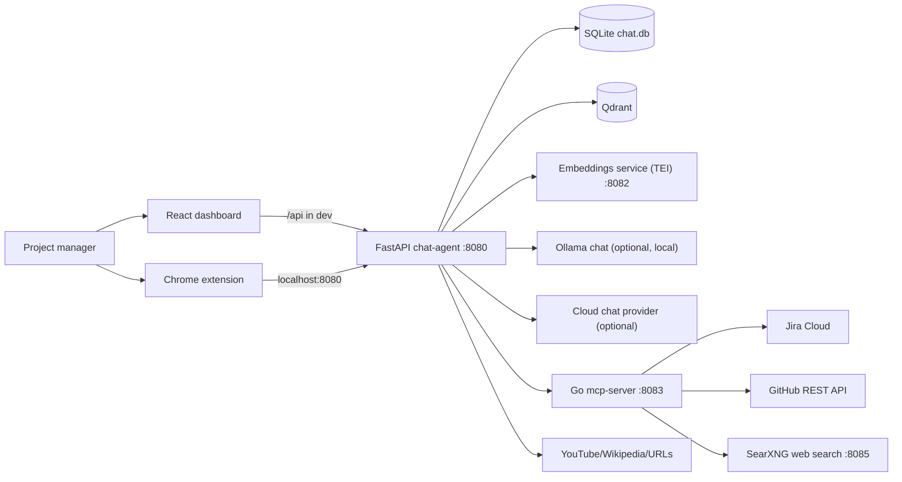
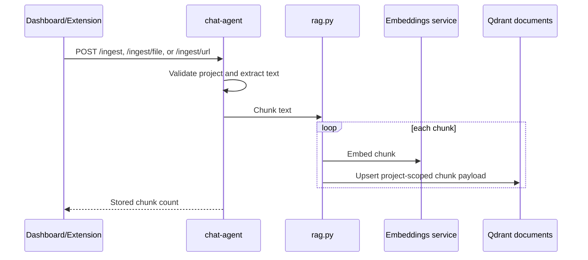
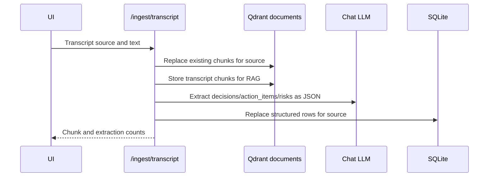
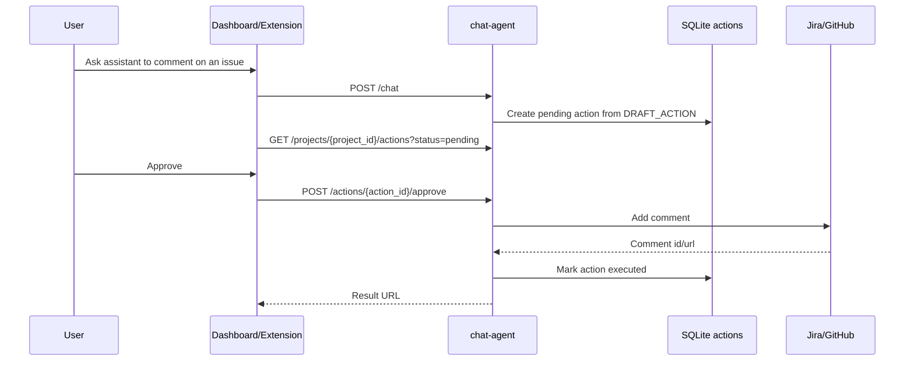

# Research Agent - Local-first AI Project Memory Assistant

Research Agent is a local-first AI assistant for project managers and knowledge
workers. It keeps project-scoped memory, ingests documents and meeting
transcripts, retrieves relevant context with RAG, and can sync Jira/GitHub work
items into a private project knowledge base.

The current active architecture is centered on the FastAPI `chat-agent`
service, backed by the Go `mcp-server` for all Jira/GitHub API calls. The
original "cost-aware AI agent execution engine" that this repository started
as (`agent-executor`, `policy-engine`, `gateway`) has been removed; it is not
part of the active Research Agent runtime.

## What It Does

- Creates isolated project workspaces with their own memory and sources
- Stores conversation history in SQLite
- Stores semantic memory and document chunks in Qdrant
- Embeds everything locally through a bundled embedding server (no API key,
  no cloud dependency for RAG/memory — see [Configuration](#configuration))
- Chats through local Ollama by default, or any OpenAI-compatible cloud
  provider (OpenAI, Claude, Grok, Groq, DeepSeek, ...) configured from Settings
- Can search the web (self-hosted SearXNG by default, Brave as an optional
  override) when explicitly turned on for a message
- Ingests pasted text, files, URLs, webpages, and transcripts
- Extracts decisions, action items, and risks from meeting transcripts
- Syncs Jira issues and GitHub issues/PRs into project RAG memory
- Lets the assistant draft Jira/GitHub comments for human approval
- Provides a React dashboard (with a first-run Setup Wizard and a Settings
  page for all of the above) and a Chrome side-panel extension

## Active Architecture



### Active Containers

These are the services needed to run Research Agent — all bundled via
`docker-compose.yml` except `chat-agent`/`dashboard`, which are normally run
natively for hot reload during development (see [Quick Start](#quick-start)):

| Container | Path | Responsibility |
|---|---|---|
| chat-agent | `services/chat-agent/` | FastAPI backend for projects, chat, RAG, memory, sync, transcript processing, and action approval |
| mcp-server | `services/mcp-server/` | Go service that holds Jira/GitHub credentials and proxies PM tool calls — chat-agent calls this, never the vendor APIs directly |
| qdrant | Docker image `qdrant/qdrant` | Vector database for conversation and document embeddings |
| embeddings | Docker image `ghcr.io/huggingface/text-embeddings-inference` | Bundled, purpose-built embedding server (BAAI/bge-base-en-v1.5) — always used for RAG/memory, regardless of which chat provider is active |
| searxng | Docker image `searxng/searxng` | Self-hosted web search backend for the agent's optional web-search toggle — no API key required |
| dashboard | `dashboard/` | React UI on port 5173 — `npm run dev` for hot reload, or the Docker Compose service |
| extension | `extension/` | Chrome side panel for chatting, ingesting current pages, syncing, and approving actions |
| ollama | host service (optional) | Only needed if you choose local chat in Settings > LLM Models — not used for embeddings |

### Repository Layout

```text
services/
  chat-agent/
    main.py                 FastAPI app and route orchestration
    config.py               Runtime settings from environment variables
    projects.py             SQLite project store and schema version
    memory.py               SQLite conversation history
    vectors.py              Qdrant client wrapper and project filters
    embeddings.py           Embeddings service (TEI) client
    rag.py                  Chunking, document ingest, retrieval, source listing
    llm.py                  Ollama/OpenAI-compatible chat client
    transcript.py           Transcript extraction and structured SQLite storage
    briefing.py             Project briefing assembler
    sync.py                 Jira/GitHub sync orchestration
    actions.py              Human approval action lifecycle
    extractors.py           File, audio, YouTube, Wikipedia, and generic URL extraction
    mcp_client.py           HTTP client for the mcp-server tool-call API — Jira/GitHub calls go through here
    request_context.py      Per-request correlation id (contextvar)
    tests/                  pytest coverage for core backend behaviour

  mcp-server/
    cmd/server/main.go      Entry point
    internal/mcp/           Tool-call HTTP server (GET /tools, POST /tools/call)
    internal/tools/         jira.go, github.go, web.go, files.go, memory.go — one file per tool integration

dashboard/
  src/App.jsx               Research Agent dashboard UI
  src/api.js                API wrapper for chat-agent routes
  vite.config.js            Dev proxy from /api to localhost:8080

extension/
  sidepanel.js              Chrome side panel UI logic
  background.js             Active-tab text extraction broker
  content.js                Page text extraction content script
  sidepanel.html            Extension UI shell

scripts/
  start.ps1                 Windows one-command dev startup helper (see Quick Start)
  start.cmd                 Double-clickable wrapper for start.ps1
```

## Data and Storage Model

Research Agent uses a single SQLite database plus two Qdrant collections.

SQLite tables:

| Table | Purpose |
|---|---|
| `projects` | Project records and external references such as Jira project key or GitHub repo |
| `schema_version` | Startup schema compatibility marker |
| `messages` | Conversation history scoped by `project_id` and `session_id` |
| `sync_state` | Last sync timestamp per project external reference |
| `actions` | Sync audit rows and pending/approved/rejected/executed/failed write actions |
| `decisions` | Decisions extracted from transcripts |
| `action_items` | Action items extracted from transcripts |
| `risks` | Risks extracted from transcripts |

Qdrant collections:

| Collection | Payload | Purpose |
|---|---|---|
| `conversations` | `project_id`, `session_id`, `role`, `content` | Semantic conversation memory |
| `documents` | `project_id`, `source`, `chunk_index`, `text` | RAG chunks from documents, pages, tickets, and transcripts |

Project isolation is enforced by storing `project_id` on every SQLite row and
every Qdrant payload, then filtering all reads by that project id.

## Runtime Flows

### Chat


### Document Ingestion



### Transcript Ingestion



### Human Approval for External Writes



## API Overview

The active API is served by `services/chat-agent/main.py`.

| Method | Path | Purpose |
|---|---|---|
| GET | `/health` | Liveness check |
| POST | `/projects` | Create a project |
| GET | `/projects` | List projects |
| PATCH | `/projects/{project_id}` | Update project name or external refs |
| DELETE | `/projects/{project_id}` | Delete project and cascade memory/sources/actions |
| POST | `/projects/{project_id}/sync` | Sync configured Jira/GitHub refs |
| GET | `/projects/{project_id}/sync` | Show sync state |
| POST | `/projects/{project_id}/actions` | Create a pending action |
| GET | `/projects/{project_id}/actions` | List actions, optionally by status |
| POST | `/actions/{action_id}/approve` | Execute an approved Jira/GitHub comment action |
| POST | `/actions/{action_id}/reject` | Reject a pending action |
| POST | `/ingest` | Ingest plain text into RAG |
| POST | `/ingest/transcript` | Ingest transcript and extract structured rows |
| POST | `/ingest/file` | Upload `.txt`, `.md`, `.pdf`, `.docx`, `.mp3`, `.wav`, or `.m4a` |
| POST | `/ingest/url` | Ingest YouTube, Wikipedia, or generic web content |
| GET | `/projects/{project_id}/decisions` | List transcript decisions |
| GET | `/projects/{project_id}/action-items` | List transcript action items |
| GET | `/projects/{project_id}/risks` | List transcript risks |
| GET | `/projects/{project_id}/briefing` | Generate a project briefing |
| GET | `/projects/{project_id}/sources` | List ingested sources |
| POST | `/chat` | Chat with project memory and RAG |
| GET | `/memory/search` | Debug semantic conversation memory search |

## Configuration

`chat-agent` reads environment variables through `services/chat-agent/config.py`.
Values can come from the repo-root `.env`, a service-local `.env`, Docker
Compose, or the shell. **All of the chat-provider and env-var settings below
can also be edited from the dashboard's Settings page** (Settings > LLM Models
for chat provider/model, Settings > Advanced for everything else) instead of
hand-editing `.env` — see [Quick Start](#quick-start).

| Variable | Default | Purpose |
|---|---|---|
| `LLM_PROVIDER` | `ollama` | `ollama` or `openai_compatible` |
| `OLLAMA_CHAT_MODEL` | `llama3` | Ollama chat model (only used when `LLM_PROVIDER=ollama`) |
| `OLLAMA_BASE_URL` | `http://localhost:11434` | Ollama server URL |
| `OPENAI_BASE_URL` | empty | Base URL for the OpenAI-compatible chat backend (OpenAI, Claude via Anthropic's OpenAI-compatible endpoint, Grok, Groq, DeepSeek, or any other OpenAI-compatible API) |
| `OPENAI_API_KEY` | empty | API key for the OpenAI-compatible chat backend |
| `OPENAI_MODEL` | empty | Model name for the OpenAI-compatible chat backend |
| `OPENAI_PROVIDER_LABEL` | `openai-compatible` | Name used in error messages |
| `EMBEDDINGS_BASE_URL` | `http://localhost:8082` | The bundled embeddings service (see `docker-compose.yml`'s `embeddings` service). Not user-configurable beyond the URL — the model it serves is fixed at deploy time; changing it after documents exist would invalidate everything already embedded |
| `SEARXNG_BASE_URL` | empty | Bundled SearXNG web-search backend (see `docker-compose.yml`'s `searxng` service); takes precedence over `BRAVE_SEARCH_API_KEY` when set |
| `BRAVE_SEARCH_API_KEY` | empty | Alternative web-search backend if you'd rather use Brave than SearXNG |
| `SQLITE_PATH` | `chat.db` | SQLite database path |
| `PORT` | `8080` | FastAPI port |
| `QDRANT_URL` | `http://localhost:6333` | Qdrant URL |
| `QDRANT_COLLECTION` | `conversations` | Conversation vector collection |
| `QDRANT_DOCS_COLLECTION` | `documents` | Document vector collection |
| `MEMORY_SEARCH_K` | `5` | Number of conversation memory hits |
| `JIRA_BASE_URL` | empty | Jira Cloud base URL (read only by mcp-server) |
| `JIRA_EMAIL` | empty | Jira Cloud account email (read only by mcp-server) |
| `JIRA_API_TOKEN` | empty | Jira Cloud API token (read only by mcp-server) |
| `GITHUB_TOKEN` | empty | GitHub Personal Access Token (read only by mcp-server) |

Minimal local `.env` for Ollama chat (embeddings need no config — the bundled
`embeddings` service handles that on its own):

```bash
LLM_PROVIDER=ollama
OLLAMA_CHAT_MODEL=llama3
QDRANT_URL=http://localhost:6333
```

For DeepSeek or another OpenAI-compatible backend:

```bash
LLM_PROVIDER=openai_compatible
OPENAI_BASE_URL=https://api.deepseek.com/v1
OPENAI_API_KEY=your_key_here
OPENAI_MODEL=deepseek-chat
OPENAI_PROVIDER_LABEL=DeepSeek
```

## Quick Start

### Windows: one-command startup

If you're on Windows, `scripts\start.cmd` does steps 0–3 below for you: it
creates `.env` if missing, starts the Docker infra (Qdrant, embeddings,
SearXNG, mcp-server), sets up chat-agent's virtualenv and the dashboard's
`node_modules` on first run, and opens both in their own windows with hot
reload. Just double-click it (or run `scripts\start.ps1` from PowerShell),
then open `http://localhost:5173`. Requires Python, Node.js/npm, and Docker
Desktop to already be installed — see Prerequisites below. macOS/Linux users
and anyone who wants to see what each step does should follow steps 0–4
manually.

### Prerequisites

- Python 3.12+
- Node.js and npm (for the dashboard)
- Docker and Docker Compose (for Qdrant, the bundled embeddings service, and
  bundled web search)
- Ollama, only if you want local chat — not needed for embeddings, and not
  needed at all if you'll use a cloud chat provider (Settings > LLM Models
  supports OpenAI, Claude, Grok, Groq, DeepSeek, and any other
  OpenAI-compatible endpoint):

```bash
ollama pull llama3
```

### 0. Copy the example env file

```bash
cp .env.example .env
```

Every value has a working default (local Ollama chat, bundled embeddings, no
Jira/GitHub) — this step just gives you a file to edit. You can also skip
editing `.env` by hand entirely and use the dashboard's Setup Wizard (step 3
below) or Settings page instead.

### 1. Start infra: Qdrant, embeddings, web search, mcp-server

```bash
docker compose up qdrant embeddings searxng mcp-server -d
```

The first start downloads the embedding model (a few hundred MB) — give it a
minute before moving on. `mcp-server` holds your Jira/GitHub credentials;
`chat-agent` calls it for all PM tool operations, never the vendor APIs
directly. Starting these four here — rather than the full `docker compose up`
— leaves `chat-agent` and `dashboard` to run locally with hot reload (steps
2–3), which is faster for development.

### 2. Start chat-agent

```bash
cd services/chat-agent
python -m venv venv
venv\Scripts\activate
pip install -r requirements.txt
uvicorn main:app --host 0.0.0.0 --port 8080
```

On macOS/Linux, activate the environment with:

```bash
source venv/bin/activate
```

### 3. Start the dashboard

```bash
cd dashboard
npm install
npm run dev
```

Open `http://localhost:5173`. On first run you'll land in the **Setup
Wizard** — it checks that every service above is reachable, helps you pull an
Ollama chat model (or configure a cloud provider instead), and creates your
first project. You can re-open it later, or manage everything ongoing, from
the **Settings** page.

### 4. Use the extension

See [extension/README.md](extension/README.md). The extension talks directly to
`http://localhost:8080`.

## Running Tests

Chat-agent tests:

```bash
cd services/chat-agent
pytest                                          # unit tier (no infra needed)
pytest tests/ -m integration                    # needs Qdrant/embeddings/mcp-server running; self-skips otherwise
```

mcp-server tests:

```bash
cd services/mcp-server
go build ./... && go vet ./... && gofmt -l . && go test ./... -v
```

Dashboard lint:

```bash
cd dashboard
npm run lint
```

## Known Implementation Notes

- `mcp-server` (Go, port 8083) is an **active** dependency — `chat-agent` routes
  all Jira/GitHub calls through it. Always start it alongside Qdrant.
- `dashboard/vite.config.js` proxies `/api` to `localhost:8080` for
  development (`npm run dev`, port 5173) — this is the only supported way to
  run the dashboard. The `dashboard` Docker Compose service's `nginx.conf` is
  currently broken; don't use `docker compose up dashboard`.
- The extension has UI support for retrying failed actions, but the FastAPI
  route `/actions/{action_id}/retry` is not currently implemented.
- `briefing.py` attempts a best-effort RAG lookup with a vector-store interface
  that does not match the current `VectorStore`; structured briefing data still
  works, but briefing RAG context should be corrected.
- Google Drive integration is not implemented in the current codebase.

## Security and Privacy Boundaries

- Conversation history and structured transcript data are stored locally in
  SQLite.
- Semantic vectors and document chunks are stored locally in Qdrant.
- Embeddings always run through the bundled, self-hosted embedding server —
  no document or conversation content is sent to a cloud API for embedding,
  regardless of which chat provider is active.
- Chat completion can be local Ollama or a configured external
  OpenAI-compatible provider (chosen explicitly in Settings; nothing is sent
  to a cloud provider until you configure one).
- Web search defaults to a bundled, self-hosted SearXNG instance (no API key,
  no third party) and only runs when explicitly turned on for a message;
  Brave Search API is available as an opt-in alternative.
- Jira/GitHub sync and comment approval call external APIs only when configured.
- Human approval is required before the assistant writes comments to Jira or
  GitHub.
- CORS is permissive because the active backend is intended to run on localhost.

## Active Scope

Research Agent is the entire scope of this repository:

- FastAPI chat-agent
- Go mcp-server (Jira/GitHub API gateway, web search)
- SQLite project and memory storage
- Qdrant RAG/vector memory
- Bundled embeddings service (Hugging Face Text Embeddings Inference)
- Local Ollama chat, or a cloud OpenAI-compatible chat provider
- Bundled SearXNG web search, or Brave Search API as an alternative
- Jira/GitHub sync and comment approval
- React dashboard with a first-run Setup Wizard and a Settings page
- Chrome extension
