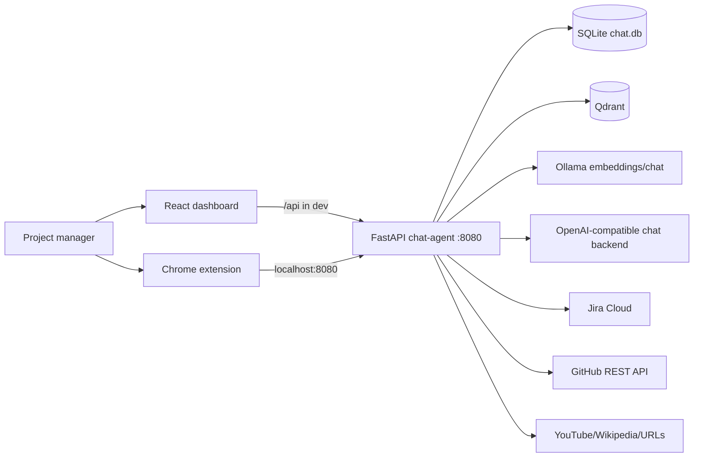
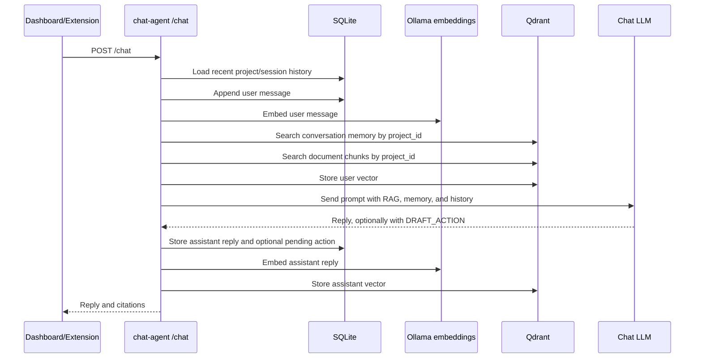
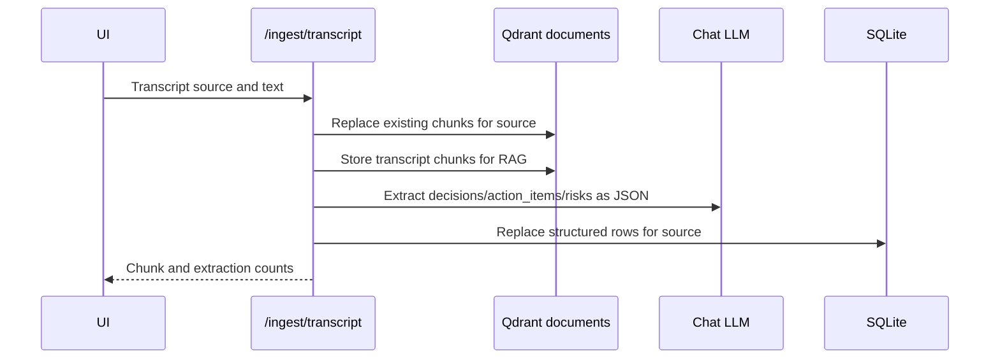
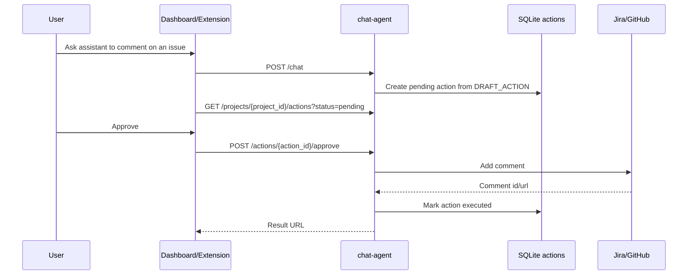

# Project Brain - Local-first AI Project Memory Assistant

Project Brain is a local-first AI assistant for project managers and knowledge
workers. It keeps project-scoped memory, ingests documents and meeting
transcripts, retrieves relevant context with RAG, and can sync Jira/GitHub work
items into a private project knowledge base.

The current active architecture is centered on the FastAPI `chat-agent`
service, backed by the Go `mcp-server` for all Jira/GitHub API calls. The
original "cost-aware AI agent execution engine" that this repository started
as (`agent-executor`, `policy-engine`, `gateway`) has been removed; it is not
part of the active Project Brain runtime.

## What It Does

- Creates isolated project workspaces with their own memory and sources
- Stores conversation history in SQLite
- Stores semantic memory and document chunks in Qdrant
- Uses Ollama for local embeddings
- Supports Ollama chat or an OpenAI-compatible chat backend
- Ingests pasted text, files, URLs, webpages, and transcripts
- Extracts decisions, action items, and risks from meeting transcripts
- Syncs Jira issues and GitHub issues/PRs into project RAG memory
- Lets the assistant draft Jira/GitHub comments for human approval
- Provides a React dashboard and a Chrome side-panel extension

## Active Architecture



### Active Containers

These are the only services needed to run Project Brain:

| Container | Path | Responsibility |
|---|---|---|
| chat-agent | `services/chat-agent/` | FastAPI backend for projects, chat, RAG, memory, sync, transcript processing, and action approval |
| mcp-server | `services/mcp-server/` | Go service that holds Jira/GitHub credentials and proxies PM tool calls — chat-agent calls this, never the vendor APIs directly |
| qdrant | Docker image `qdrant/qdrant` | Vector database for conversation and document embeddings |
| dashboard | `dashboard/` | React UI on port 5173 — `npm run dev` for hot reload, or the Docker Compose service |
| extension | `extension/` | Chrome side panel for chatting, ingesting current pages, syncing, and approving actions |
| ollama | host service | Local embedding model and optional local chat model |

### Repository Layout

```text
services/
  chat-agent/
    main.py                 FastAPI app and route orchestration
    config.py               Runtime settings from environment variables
    projects.py             SQLite project store and schema version
    memory.py               SQLite conversation history
    vectors.py              Qdrant client wrapper and project filters
    embeddings.py           Ollama embedding client
    rag.py                  Chunking, document ingest, retrieval, source listing
    llm.py                  Ollama/OpenAI-compatible chat client
    transcript.py           Transcript extraction and structured SQLite storage
    briefing.py             Project briefing assembler
    sync.py                 Jira/GitHub sync orchestration
    actions.py              Human approval action lifecycle
    extractors.py           File, audio, YouTube, Wikipedia, and generic URL extraction
    mcp_client.py           HTTP client for the mcp-server tool-call API — Jira/GitHub calls go through here
    request_context.py      Per-request correlation id (contextvar)
    tests/                  pytest coverage for core backend behaviour

  mcp-server/
    cmd/server/main.go      Entry point
    internal/mcp/           Tool-call HTTP server (GET /tools, POST /tools/call)
    internal/tools/         jira.go, github.go, web.go, files.go, memory.go — one file per tool integration

dashboard/
  src/App.jsx               Project Brain dashboard UI
  src/api.js                API wrapper for chat-agent routes
  vite.config.js            Dev proxy from /api to localhost:8080

extension/
  sidepanel.js              Chrome side panel UI logic
  background.js             Active-tab text extraction broker
  content.js                Page text extraction content script
  sidepanel.html            Extension UI shell
```

## Data and Storage Model

Project Brain uses a single SQLite database plus two Qdrant collections.

SQLite tables:

| Table | Purpose |
|---|---|
| `projects` | Project records and external references such as Jira project key or GitHub repo |
| `schema_version` | Startup schema compatibility marker |
| `messages` | Conversation history scoped by `project_id` and `session_id` |
| `sync_state` | Last sync timestamp per project external reference |
| `actions` | Sync audit rows and pending/approved/rejected/executed/failed write actions |
| `decisions` | Decisions extracted from transcripts |
| `action_items` | Action items extracted from transcripts |
| `risks` | Risks extracted from transcripts |

Qdrant collections:

| Collection | Payload | Purpose |
|---|---|---|
| `conversations` | `project_id`, `session_id`, `role`, `content` | Semantic conversation memory |
| `documents` | `project_id`, `source`, `chunk_index`, `text` | RAG chunks from documents, pages, tickets, and transcripts |

Project isolation is enforced by storing `project_id` on every SQLite row and
every Qdrant payload, then filtering all reads by that project id.

## Runtime Flows

### Chat



### Document Ingestion


### Transcript Ingestion



### Human Approval for External Writes



## API Overview

The active API is served by `services/chat-agent/main.py`.

| Method | Path | Purpose |
|---|---|---|
| GET | `/health` | Liveness check |
| POST | `/projects` | Create a project |
| GET | `/projects` | List projects |
| PATCH | `/projects/{project_id}` | Update project name or external refs |
| DELETE | `/projects/{project_id}` | Delete project and cascade memory/sources/actions |
| POST | `/projects/{project_id}/sync` | Sync configured Jira/GitHub refs |
| GET | `/projects/{project_id}/sync` | Show sync state |
| POST | `/projects/{project_id}/actions` | Create a pending action |
| GET | `/projects/{project_id}/actions` | List actions, optionally by status |
| POST | `/actions/{action_id}/approve` | Execute an approved Jira/GitHub comment action |
| POST | `/actions/{action_id}/reject` | Reject a pending action |
| POST | `/ingest` | Ingest plain text into RAG |
| POST | `/ingest/transcript` | Ingest transcript and extract structured rows |
| POST | `/ingest/file` | Upload `.txt`, `.md`, `.pdf`, `.docx`, `.mp3`, `.wav`, or `.m4a` |
| POST | `/ingest/url` | Ingest YouTube, Wikipedia, or generic web content |
| GET | `/projects/{project_id}/decisions` | List transcript decisions |
| GET | `/projects/{project_id}/action-items` | List transcript action items |
| GET | `/projects/{project_id}/risks` | List transcript risks |
| GET | `/projects/{project_id}/briefing` | Generate a project briefing |
| GET | `/projects/{project_id}/sources` | List ingested sources |
| POST | `/chat` | Chat with project memory and RAG |
| GET | `/memory/search` | Debug semantic conversation memory search |

## Configuration

`chat-agent` reads environment variables through `services/chat-agent/config.py`.
Values can come from the repo-root `.env`, a service-local `.env`, Docker
Compose, or the shell.

| Variable | Default | Purpose |
|---|---|---|
| `LLM_PROVIDER` | `ollama` | `ollama` or `openai_compatible` |
| `OLLAMA_CHAT_MODEL` | `llama3` | Ollama chat model |
| `OPENAI_BASE_URL` | empty | Base URL for OpenAI-compatible chat |
| `OPENAI_API_KEY` | empty | API key for OpenAI-compatible chat |
| `OPENAI_MODEL` | empty | Model name for OpenAI-compatible chat |
| `OPENAI_PROVIDER_LABEL` | `openai-compatible` | Name used in error messages |
| `SQLITE_PATH` | `chat.db` | SQLite database path |
| `PORT` | `8080` | FastAPI port |
| `OLLAMA_BASE_URL` | `http://localhost:11434` | Ollama server URL |
| `OLLAMA_EMBED_MODEL` | `nomic-embed-text` | Embedding model |
| `QDRANT_URL` | `http://localhost:6333` | Qdrant URL |
| `QDRANT_COLLECTION` | `conversations` | Conversation vector collection |
| `QDRANT_DOCS_COLLECTION` | `documents` | Document vector collection |
| `MEMORY_SEARCH_K` | `5` | Number of conversation memory hits |
| `JIRA_BASE_URL` | empty | Jira Cloud base URL |
| `JIRA_EMAIL` | empty | Jira Cloud account email |
| `JIRA_API_TOKEN` | empty | Jira Cloud API token |
| `GITHUB_TOKEN` | empty | GitHub Personal Access Token |

Minimal local `.env` for Ollama chat:

```bash
LLM_PROVIDER=ollama
OLLAMA_CHAT_MODEL=llama3
OLLAMA_EMBED_MODEL=nomic-embed-text
QDRANT_URL=http://localhost:6333
```

For DeepSeek or another OpenAI-compatible backend:

```bash
LLM_PROVIDER=openai_compatible
OPENAI_BASE_URL=https://api.deepseek.com/v1
OPENAI_API_KEY=your_key_here
OPENAI_MODEL=deepseek-chat
OPENAI_PROVIDER_LABEL=DeepSeek
```

## Quick Start

### Prerequisites

- Python 3.12+
- Docker and Docker Compose for Qdrant
- Ollama running locally
- Ollama embedding model:

```bash
ollama pull nomic-embed-text
```

If using local Ollama chat:

```bash
ollama pull llama3
```

### 1. Start Qdrant and mcp-server

```bash
docker compose up qdrant mcp-server -d
```

`mcp-server` holds your Jira and GitHub credentials. `chat-agent` calls it for
all PM tool operations. Starting only these two here — rather than the full
`docker compose up` — leaves `chat-agent` and `dashboard` to run locally with
hot reload (steps 2–3), which is faster for development.

### 2. Start chat-agent

```bash
cd services/chat-agent
python -m venv venv
venv\Scripts\activate
pip install -r requirements.txt
uvicorn main:app --host 0.0.0.0 --port 8080
```

On macOS/Linux, activate the environment with:

```bash
source venv/bin/activate
```

### 3. Start the dashboard

```bash
cd dashboard
npm install
npm run dev
```

Open `http://localhost:5173`.

### 4. Use the extension

See [extension/README.md](extension/README.md). The extension talks directly to
`http://localhost:8080`.

## Running Tests

Chat-agent tests:

```bash
cd services/chat-agent
pytest
```

Dashboard lint:

```bash
cd dashboard
npm run lint
```

## Known Implementation Notes

- `mcp-server` (Go, port 8083) is an **active** dependency — `chat-agent` routes
  all Jira/GitHub calls through it. Always start it alongside Qdrant.
- `dashboard/vite.config.js` proxies `/api` to `localhost:8080` for
  development (`npm run dev`, port 5173). The `dashboard` Docker Compose
  service's `nginx.conf` also proxies `/api` to `chat-agent:8080` on port
  5173, so both paths work correctly.
- The extension has UI support for retrying failed actions, but the FastAPI
  route `/actions/{action_id}/retry` is not currently implemented.
- `briefing.py` attempts a best-effort RAG lookup with a vector-store interface
  that does not match the current `VectorStore`; structured briefing data still
  works, but briefing RAG context should be corrected.
- Google Drive integration is not implemented in the current codebase.

## Security and Privacy Boundaries

- Conversation history and structured transcript data are stored locally in
  SQLite.
- Semantic vectors and document chunks are stored locally in Qdrant.
- Embeddings use local Ollama by default.
- Chat completion can be local Ollama or a configured external
  OpenAI-compatible provider.
- Jira/GitHub sync and comment approval call external APIs only when configured.
- Human approval is required before the assistant writes comments to Jira or
  GitHub.
- CORS is permissive because the active backend is intended to run on localhost.

## Active Scope

Project Brain is the entire scope of this repository:

- FastAPI chat-agent
- Go mcp-server (Jira/GitHub API gateway)
- SQLite project and memory storage
- Qdrant RAG/vector memory
- Ollama embeddings
- Optional OpenAI-compatible chat provider
- Jira/GitHub sync and comment approval
- React dashboard
- Chrome extension
